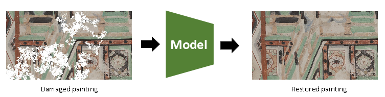

# Dunhuang-Image-Restoration
## final project of NTU DLCV fall2019
Dunhuang Image Restoration using partial convolution and SSIM loss



## Introduction
In this challenge, you are asked to restore damaged paintings, where you can take advantage of the knowledge and skill learned in DLCV lessons. This is a " **Image Inpainting** " task, you are encouraged to search for related resources on your own. 

The original challenge website is provided [here](http://www.eheritage-ws.org/).

## Dataset 
To get the dataset for this challenge, please use the following command: 
```
bash download.sh
```
All the data is under *./Data_Challenge2*, and the dataset is aranged as below:
* **train/** : 400 damaged images (* _masked.jpg) and corresponding masks (* _mask.jpg) for training. 
* **train_gt/** : 400 ground truth images (* .jpg) for training.
* **test/** : 100 damaged images (* _masked.jpg) and corresponding masks (* _mask.jpg) for testing. 
* **test_gt/** : 100 ground truth images (* .jpg) for testing.

### Inference
To install dependencies
```
pip3 install -r requirements.txt
```

To execute script
```
CUDA_VISIBLE_DEVICES=GPU_NUMBER bash final.sh $1 $2
```
* `$1` is the source folder (e.g. `Data_Challenge2/test/`)of testing images (The contents are the same as `Data_Challenge2/test/`)
* `$2` is the folder (e.g. `Data_Challenge2/pred/`) to save the restored images (predicted images). If the input image is name xxx.jpg, the outputed image will be name xxx.jpg. 

### Evaluation
We evaluate the quality of your restored images with Mean Square Error (MSE) and Structural Similarity Index (SSIM). We provide the script (`evaluate.py`) to evaluate the performance of your model. You can use the following command to evaluate your model.
```
python3 evaluate.py -g $1 -p $2
```
* `$1` : folder of ground truth images. (e.g. `./Data_Challenge2/test_gt/`).
* `$2` : folder of your predicted images. (e.g. `Data_Challenge2/pred/`)