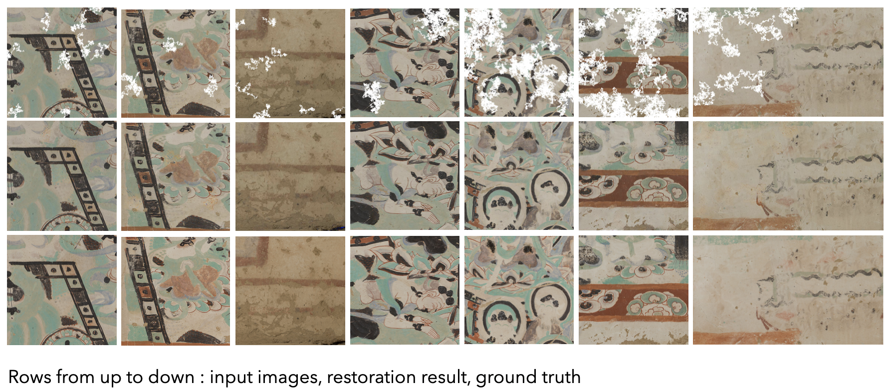

# Dunhuang-Image-Restoration
## final project of NTU DLCV fall2019
Dunhuang Image Restoration using partial convolution and SSIM loss \
by 鄭揚，李信穎，唐瑋廷


## Introduction
In this project, we employed NVIDIA’s Partial Convolutions with an U-Net architecture and structural similarity loss function to restore incomplete Dunhuang images. The model surpassed baseline with quantitative evaluation and produced high-quality restoration result.

The original challenge website is provided [here](http://www.eheritage-ws.org/).

## Result

 |Score|value|
 |---|---|
 |MSE| 35.153|
 |SSIM| 0.805|




## Dataset 
To get the dataset for this project, please use the following command: 
```
bash download.sh
```
All the data is under *./Data_Challenge2*, and the dataset is aranged as below:
* **train/** : 400 damaged images (* _masked.jpg) and corresponding masks (* _mask.jpg) for training. 
* **train_gt/** : 400 ground truth images (* .jpg) for training.
* **test/** : 100 damaged images (* _masked.jpg) and corresponding masks (* _mask.jpg) for testing. 
* **test_gt/** : 100 ground truth images (* .jpg) for testing.

### Inference
To install dependencies
```
pip3 install -r requirements.txt
```

To execute script
```
CUDA_VISIBLE_DEVICES=GPU_NUMBER bash final.sh $1 $2
```
* `$1` is the source folder (e.g. `Data_Challenge2/test/`)of testing images (The contents are the same as `Data_Challenge2/test/`)
* `$2` is the folder (e.g. `Data_Challenge2/pred/`) to save the restored images (predicted images). If the input image is name xxx.jpg, the outputed image will be name xxx.jpg. 

### Evaluation
We evaluate the quality of restored images with Mean Square Error (MSE) and Structural Similarity Index (SSIM).
```
python3 evaluate.py -g $1 -p $2
```
* `$1` : folder of ground truth images. (e.g. `./Data_Challenge2/test_gt/`).
* `$2` : folder of your predicted images. (e.g. `Data_Challenge2/pred/`)